# M8 diagnostic peek — Step 2 fingerprints

> **Diagnostic observation, not an M8 finding.**

## Top-5 distinguishing features by |SMD| (primary read)

No category aggregation. Question: does any prototype's top-5 include
`is_return`, a `loop_role_*`, or `rel_t` (t/T)?

**Answer: 11/12 prototypes** have return / loop-role / rel_t in their top-5.

### Prototype 0 ← history markers: ['loop_role_none']

| Rank | Feature | SMD | |SMD| |
|------|---------|-----|-------|
| 1 | `panel_commentary` | -0.446 | 0.446 |
| 2 | `loop_role_none` | -0.367 | 0.367 |
| 3 | `template__question→response→question` | +0.359 | 0.359 |
| 4 | `panel_mark_scheme` | +0.310 | 0.310 |
| 5 | `panel_outside` | -0.299 | 0.299 |

### Prototype 1 ← history markers: ['loop_role_none', 'loop_role_origin']

| Rank | Feature | SMD | |SMD| |
|------|---------|-----|-------|
| 1 | `panel_commentary` | +1.712 | 1.712 |
| 2 | `loop_role_none` | +0.703 | 0.703 |
| 3 | `panel_response` | -0.668 | 0.668 |
| 4 | `panel_mark_scheme` | -0.656 | 0.656 |
| 5 | `loop_role_origin` | -0.619 | 0.619 |

### Prototype 2

| Rank | Feature | SMD | |SMD| |
|------|---------|-----|-------|
| 1 | `relation_EMPTY_SPACE_TRANSITION` | +2.806 | 2.806 |
| 2 | `panel_outside` | +2.573 | 2.573 |
| 3 | `assignment_confidence` | -1.589 | 1.589 |
| 4 | `relation_NO_DIRECT_RELATION` | -1.360 | 1.360 |
| 5 | `panel_commentary` | -0.687 | 0.687 |

### Prototype 3 ← history markers: ['loop_role_none', 'loop_role_origin']

| Rank | Feature | SMD | |SMD| |
|------|---------|-----|-------|
| 1 | `panel_mark_scheme` | +1.876 | 1.876 |
| 2 | `template__mark_scheme→response→mark_scheme` | +1.670 | 1.670 |
| 3 | `loop_role_none` | -0.869 | 0.869 |
| 4 | `loop_role_origin` | +0.758 | 0.758 |
| 5 | `panel_commentary` | -0.726 | 0.726 |

### Prototype 4 ← history markers: ['rel_t']

| Rank | Feature | SMD | |SMD| |
|------|---------|-----|-------|
| 1 | `panel_question` | +3.235 | 3.235 |
| 2 | `panel_commentary` | -0.688 | 0.688 |
| 3 | `panel_response` | -0.629 | 0.629 |
| 4 | `rel_t` | -0.610 | 0.610 |
| 5 | `panel_mark_scheme` | -0.601 | 0.601 |

### Prototype 5 ← history markers: ['rel_t']

| Rank | Feature | SMD | |SMD| |
|------|---------|-----|-------|
| 1 | `panel_mark_scheme` | +1.707 | 1.707 |
| 2 | `rel_t` | -0.689 | 0.689 |
| 3 | `template__response→mark_scheme_level_descriptor→response` | +0.655 | 0.655 |
| 4 | `panel_commentary` | -0.635 | 0.635 |
| 5 | `panel_response` | -0.602 | 0.602 |

### Prototype 6 ← history markers: ['loop_role_closure']

| Rank | Feature | SMD | |SMD| |
|------|---------|-----|-------|
| 1 | `panel_response` | +1.889 | 1.889 |
| 2 | `visit_count` | +1.064 | 1.064 |
| 3 | `panel_commentary` | -0.734 | 0.734 |
| 4 | `panel_mark_scheme` | -0.655 | 0.655 |
| 5 | `loop_role_closure` | +0.451 | 0.451 |

### Prototype 7 ← history markers: ['loop_role_none', 'loop_role_origin']

| Rank | Feature | SMD | |SMD| |
|------|---------|-----|-------|
| 1 | `panel_commentary` | +1.617 | 1.617 |
| 2 | `loop_role_none` | +0.688 | 0.688 |
| 3 | `panel_response` | -0.630 | 0.630 |
| 4 | `panel_mark_scheme` | -0.616 | 0.616 |
| 5 | `loop_role_origin` | -0.584 | 0.584 |

### Prototype 8 ← history markers: ['loop_role_none', 'loop_role_origin']

| Rank | Feature | SMD | |SMD| |
|------|---------|-----|-------|
| 1 | `panel_commentary` | +1.681 | 1.681 |
| 2 | `loop_role_none` | +0.715 | 0.715 |
| 3 | `panel_response` | -0.653 | 0.653 |
| 4 | `panel_mark_scheme` | -0.642 | 0.642 |
| 5 | `loop_role_origin` | -0.606 | 0.606 |

### Prototype 9 ← history markers: ['loop_role_origin', 'loop_role_none']

| Rank | Feature | SMD | |SMD| |
|------|---------|-----|-------|
| 1 | `template__response→mark_scheme→response` | +2.333 | 2.333 |
| 2 | `loop_role_origin` | +1.825 | 1.825 |
| 3 | `panel_response` | +1.814 | 1.814 |
| 4 | `loop_role_none` | -1.601 | 1.601 |
| 5 | `panel_commentary` | -0.704 | 0.704 |

### Prototype 10 ← history markers: ['loop_role_none', 'loop_role_origin']

| Rank | Feature | SMD | |SMD| |
|------|---------|-----|-------|
| 1 | `panel_star_chart` | +3.977 | 3.977 |
| 2 | `panel_response` | -0.602 | 0.602 |
| 3 | `loop_role_none` | +0.590 | 0.590 |
| 4 | `loop_role_origin` | -0.554 | 0.554 |
| 5 | `panel_mark_scheme` | -0.485 | 0.485 |

### Prototype 11 ← history markers: ['loop_role_none', 'loop_role_origin']

| Rank | Feature | SMD | |SMD| |
|------|---------|-----|-------|
| 1 | `panel_mark_scheme` | +1.768 | 1.768 |
| 2 | `panel_commentary` | -0.673 | 0.673 |
| 3 | `loop_role_none` | +0.631 | 0.631 |
| 4 | `panel_response` | -0.619 | 0.619 |
| 5 | `loop_role_origin` | -0.530 | 0.530 |

## Prototype 9 — strongest history signal (detail)

This is the only prototype whose aggregate history |SMD| exceeded static,
and its top-5 is readable without averaging:

1. **`template__response→mark_scheme→response`** SMD=+2.333 (elevated vs others)
2. **`loop_role_origin`** SMD=+1.825 (elevated vs others)
3. **`panel_response`** SMD=+1.814 (elevated vs others)
4. **`loop_role_none`** SMD=-1.601 (depressed vs others)
5. **`panel_commentary`** SMD=-0.704 (depressed vs others)

Read: prototype 9 concentrates **response→mark_scheme→response** loop
origins on the **response** panel (high `loop_role_origin`, low `loop_role_none`),
not a static panel-only blob.

## Tornado charts

### Prototype 0

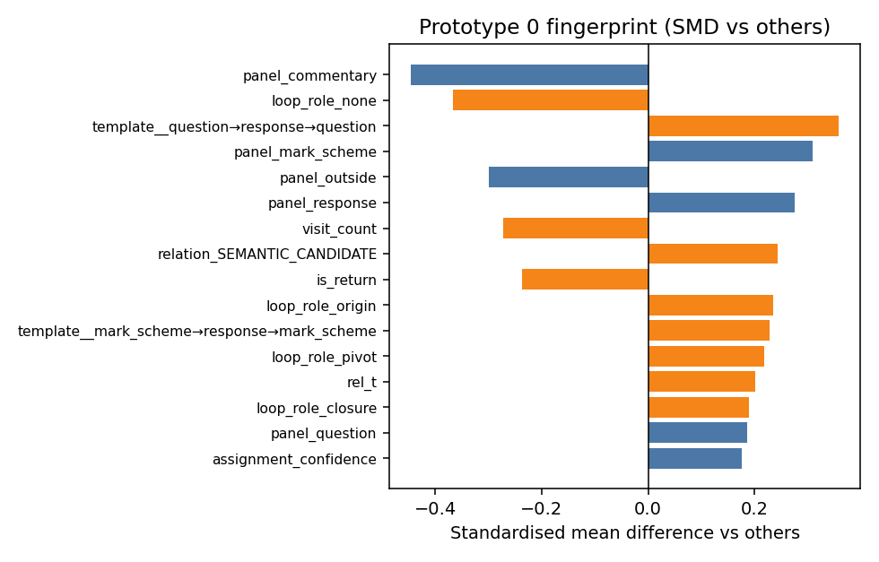

### Prototype 1

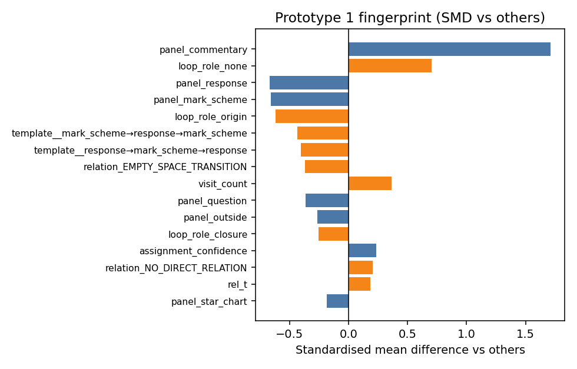

### Prototype 2

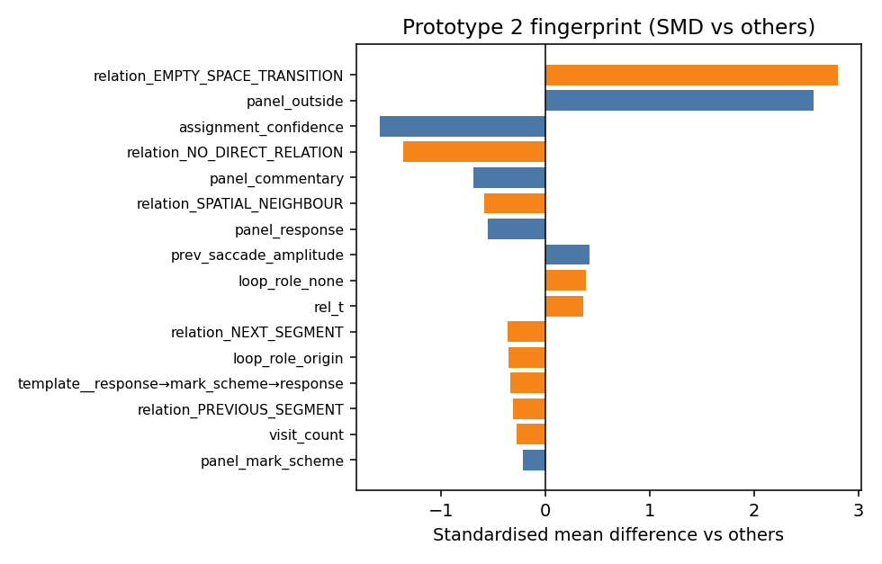

### Prototype 3

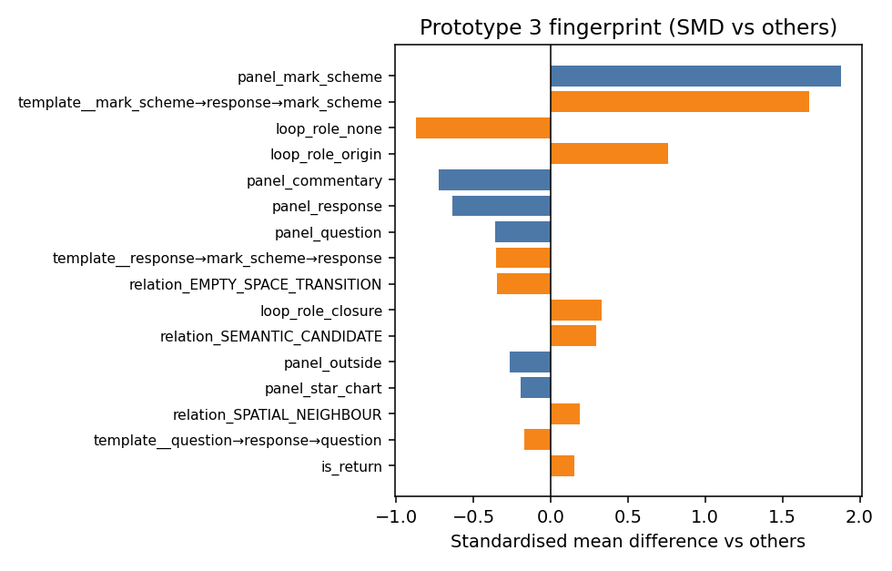

### Prototype 4

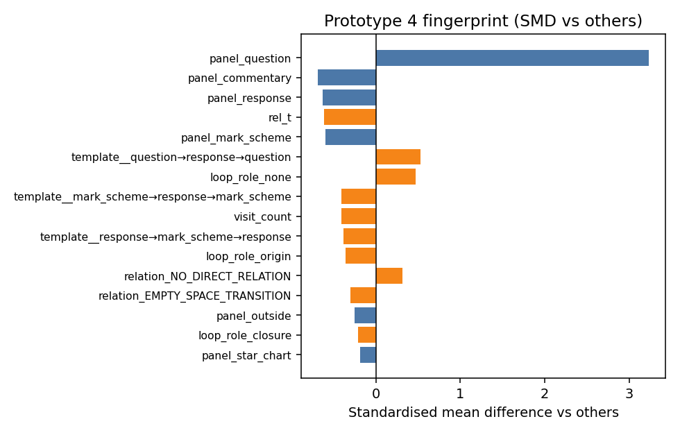

### Prototype 5

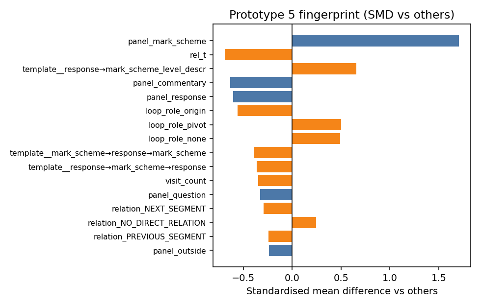

### Prototype 6

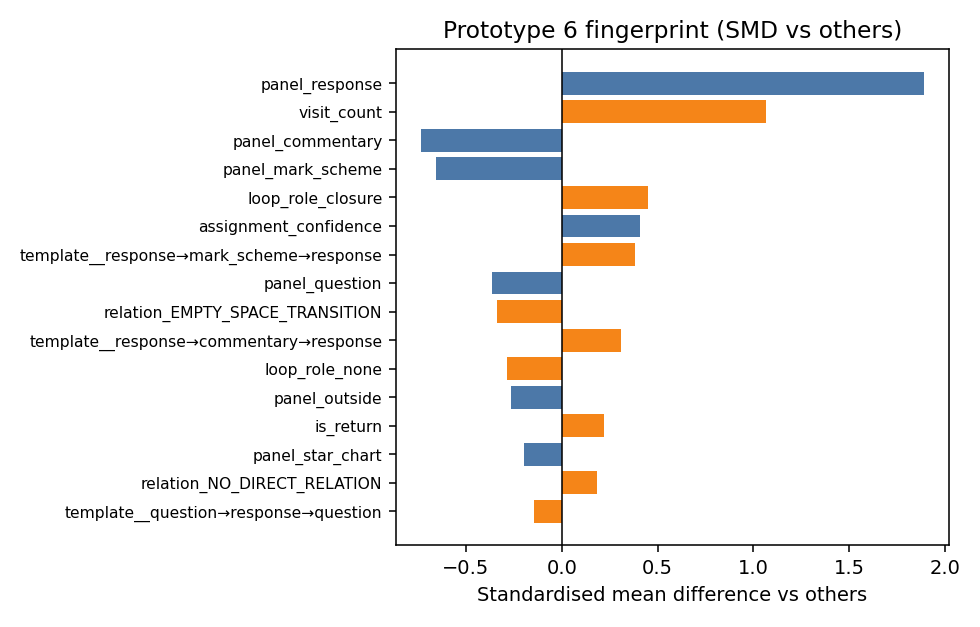

### Prototype 7

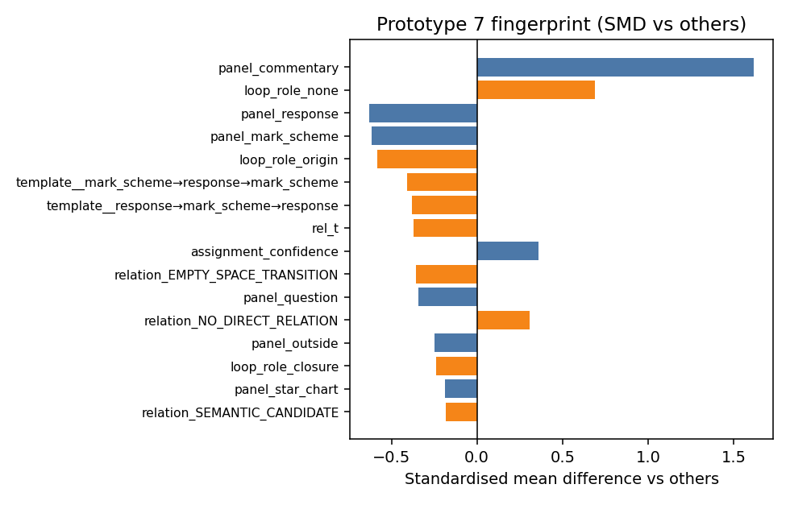

### Prototype 8

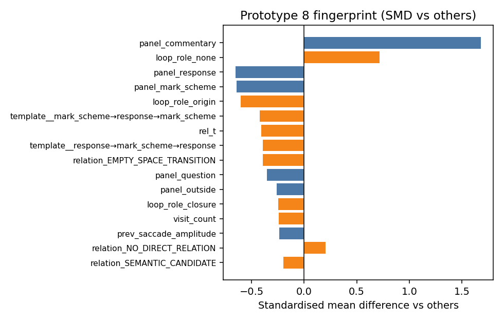

### Prototype 9

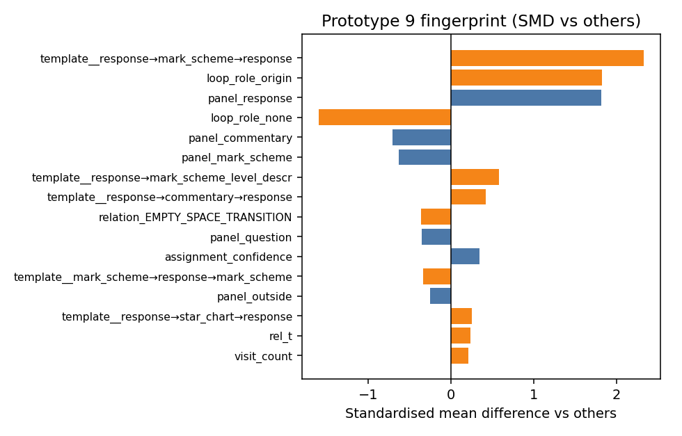

### Prototype 10

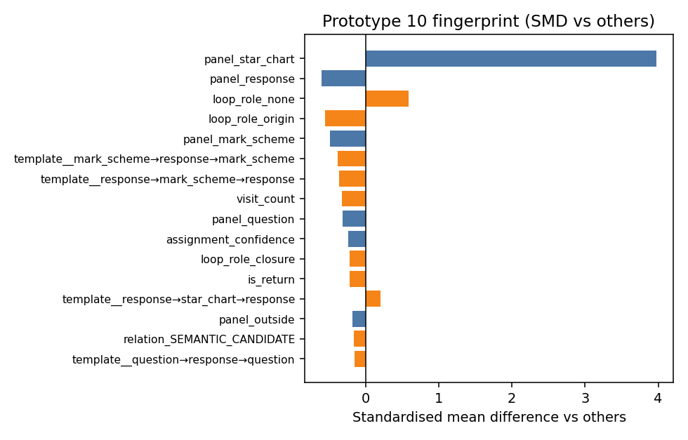

### Prototype 11

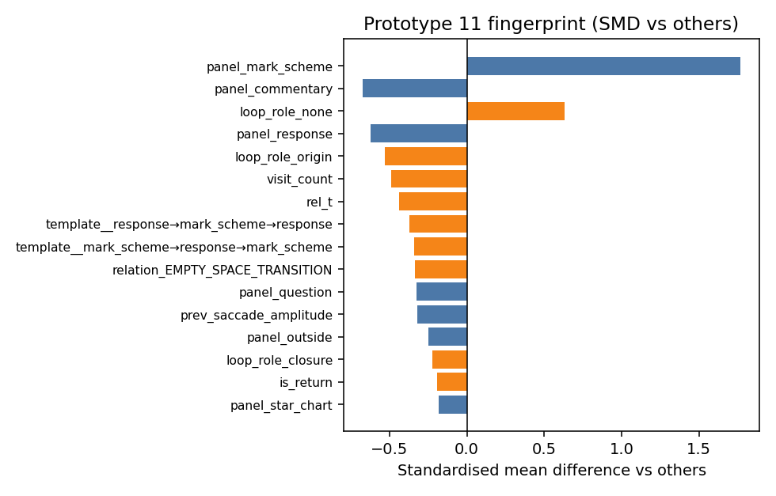

## Within-participant occupancy (top-5 by duration mass)

Flag if >60% of a prototype's duration mass sits with one participant.

- Prototype 0: top=P10 (27.1%)
  - shares: `{'P03': 0.0965, 'P06': 0.2299, 'P10': 0.2707, 'P12': 0.2078, 'P21': 0.1952}`
- Prototype 1: top=P10 (29.1%)
  - shares: `{'P03': 0.057, 'P06': 0.2301, 'P10': 0.291, 'P12': 0.2109, 'P21': 0.2109}`
- Prototype 3: top=P10 (31.0%)
  - shares: `{'P03': 0.0947, 'P06': 0.2137, 'P10': 0.3102, 'P12': 0.161, 'P21': 0.2203}`
- Prototype 6: top=P10 (27.4%)
  - shares: `{'P03': 0.109, 'P06': 0.2321, 'P10': 0.274, 'P12': 0.1646, 'P21': 0.2202}`
- Prototype 8: top=P06 (40.7%)
  - shares: `{'P03': 0.1866, 'P06': 0.4071, 'P10': 0.0339, 'P12': 0.025, 'P21': 0.3474}`

## Secondary aggregate (do not prefer over top-5 lists)

1/12 prototypes have higher mean |SMD| on history/phase/relation features than on static features (aggregate only — prefer top-5 feature lists).

Exemplars: HTML for **all** prototypes (see `exemplars/`).
