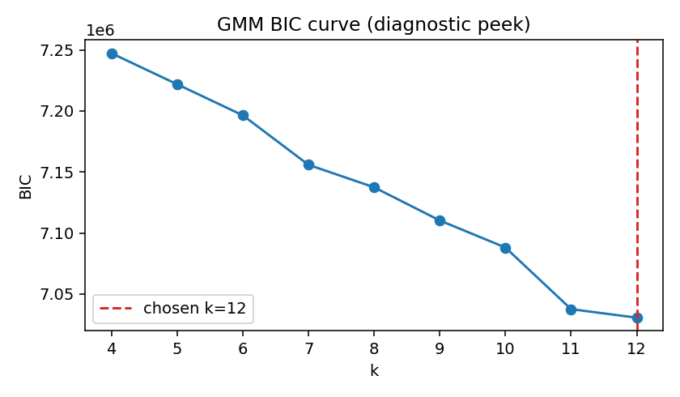
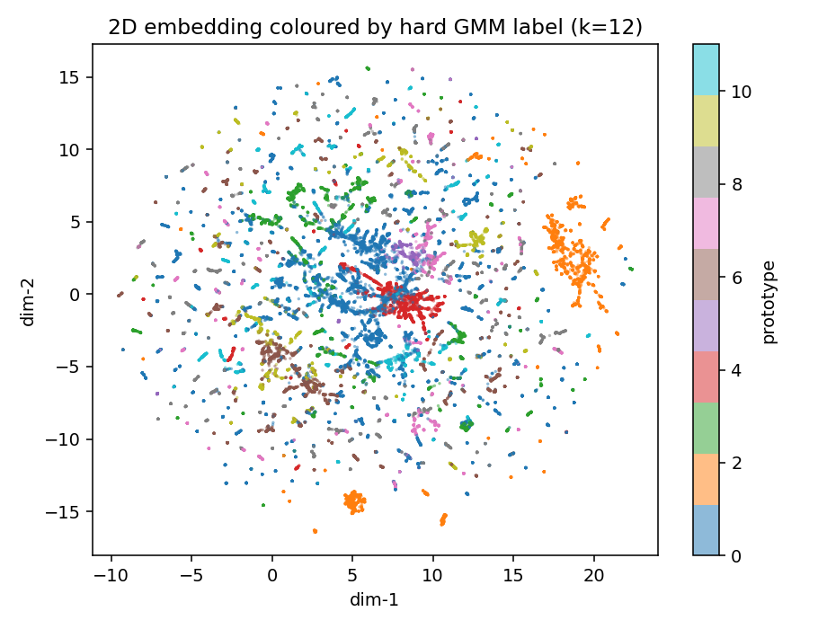

# M8 diagnostic peek — Step 1 structure

> **Diagnostic only** — not an M8 finding. GMM fit on **grouped-val**
> participants only (held-out). Real M8 will fit on train per fold;
> this peek's chosen k / labels feed **nothing** downstream.

- Checkpoint / tokens: `D:\Projects\GNN-Transformer-Eye-Tracking\runs\m6_fullseq_graphbias_return_aux\fold0_seed13\checkpoint_best.pt`
- Val participants: P03, P06, P10, P12, P21
- Tokens: **46004** × emb_dim **192**
- PCA: **44** components retaining **0.902** variance (target 90%)
- BIC-chosen **k = 12**

## BIC curve

| k | BIC |
|---|-----|
| 4 | 7247214.1 |
| 5 | 7221812.3 |
| 6 | 7196367.6 |
| 7 | 7155805.4 |
| 8 | 7137386.0 |
| 9 | 7110206.8 |
| 10 | 7088029.1 |
| 11 | 7037550.9 |
| 12 | 7030553.2 ← |

## Stability

| Regime | Mean pairwise AMI | Within-participant null AMI (mean±std) |
|--------|-------------------|----------------------------------------|
| Random 80% tokens | **0.862** | 0.002 ± 0.000 |
| Stratified 80% episodes (all 5 Pids) | **0.774** | 0.002 ± 0.000 |

### Random-regime subsample composition

- Fit 0: n_tokens=36803, participants=['P03', 'P06', 'P10', 'P12', 'P21'] (n=5)
- Fit 1: n_tokens=36803, participants=['P03', 'P06', 'P10', 'P12', 'P21'] (n=5)
- Fit 2: n_tokens=36803, participants=['P03', 'P06', 'P10', 'P12', 'P21'] (n=5)

### Stratified-regime subsample composition

- Fit 0: n_tokens=37351, n_episodes=120, participants=['P03', 'P06', 'P10', 'P12', 'P21'] (n=5)
- Fit 1: n_tokens=33883, n_episodes=120, participants=['P03', 'P06', 'P10', 'P12', 'P21'] (n=5)
- Fit 2: n_tokens=39020, n_episodes=120, participants=['P03', 'P06', 'P10', 'P12', 'P21'] (n=5)

## Gate verdict

**stable** — AMI > 0.7 across both regimes.

- Proceed to Step 2: **True**

## 2D scatter (eyeball only — do not over-read)

UMAP-2D on PCA features.

## Reproducibility

- Per-token embeddings: `D:\Projects\GNN-Transformer-Eye-Tracking\reports\m8_diagnostic_peek\tokens\embeddings.npz`
- Token table: `D:\Projects\GNN-Transformer-Eye-Tracking\reports\m8_diagnostic_peek\tokens\token_table.parquet`
- Assignments: `D:\Projects\GNN-Transformer-Eye-Tracking\reports\m8_diagnostic_peek\assignments.parquet`
- Collect meta (participants): `D:\Projects\GNN-Transformer-Eye-Tracking\reports\m8_diagnostic_peek\tokens\collect_meta.json`
